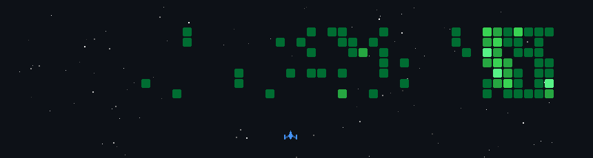

  

<h3 align="center">AI Enthusiast |Open Source Contributor | Lifelong Learner</h3>

  

<!-- &nbsp; -->
<!-- <h1 align="center">
  Hello , 
  I am Prathyun Gupta
  
</h1> -->

  

Hi  My name is Mr Alpha
=================================================================================================================================

🎓 Engineering Student | 💻 Full-Stack Developer | 🤖 AI & Cloud Enthusiast
---------------------------------------------------------------------------

I’m a passionate developer who loves building real-world, production-ready applications using modern web technologies.

From hackathons to full-stack deployments, I focus on learning by building.

* 🌍  I'm based in India
* 🖥️  See my portfolio at [My Portfolio](http://suhasm.online)
* ✉️  You can contact me at [sm4686771@gmail.com](mailto:sm4686771@gmail.com)
* 🚀  I'm currently working on [ExamGuardPro – an AI-powered secure online examination platform](http://examguardprobrowser.onrender.com)
* 🧠  I'm currently learning Advanced full-stack development, system design, and cloud deployment
* 👥  I'm looking to collaborate on Startup ideas, SaaS products, AI + web development projects
* 💬  Ask me about I believe in building real products, not just demo projects -🚀Always building. Always learning.

### Socials

 <a href="https://www.github.com/MrAlpha00" target="_blank" rel="noreferrer"> <picture> <source media="(prefers-color-scheme: dark)" srcset="https://raw.githubusercontent.com/danielcranney/readme-generator/main/public/icons/socials/github-dark.svg" /> <source media="(prefers-color-scheme: light)" srcset="https://raw.githubusercontent.com/danielcranney/readme-generator/main/public/icons/socials/github.svg" />  </picture> </a> <a href="https://www.gitlab.com/MrAlpha00" target="_blank" rel="noreferrer"> <picture> <source media="(prefers-color-scheme: dark)" srcset="" /> <source media="(prefers-color-scheme: light)" srcset="https://raw.githubusercontent.com/danielcranney/readme-generator/main/public/icons/socials/gitlab.svg" />  </picture> </a> <a href="https://www.x.com/MrAlpha00" target="_blank" rel="noreferrer"> <picture> <source media="(prefers-color-scheme: dark)" srcset="https://raw.githubusercontent.com/danielcranney/readme-generator/main/public/icons/socials/twitter-dark.svg" /> <source media="(prefers-color-scheme: light)" srcset="https://raw.githubusercontent.com/danielcranney/readme-generator/main/public/icons/socials/twitter.svg" />  </picture> </a> <a href="https://www.linkedin.com/in/MrAlpha00" target="_blank" rel="noreferrer"> <picture> <source media="(prefers-color-scheme: dark)" srcset="https://raw.githubusercontent.com/danielcranney/readme-generator/main/public/icons/socials/linkedin-dark.svg" /> <source media="(prefers-color-scheme: light)" srcset="https://raw.githubusercontent.com/danielcranney/readme-generator/main/public/icons/socials/linkedin.svg" />  </picture> </a> <a href="https://www.youtube.com/@suhastech1" target="_blank" rel="noreferrer"> <picture> <source media="(prefers-color-scheme: dark)" srcset="https://raw.githubusercontent.com/danielcranney/readme-generator/main/public/icons/socials/youtube-dark.svg" /> <source media="(prefers-color-scheme: light)" srcset="https://raw.githubusercontent.com/danielcranney/readme-generator/main/public/icons/socials/youtube.svg" />  </picture> </a> <a href="https://codesandbox.io/u/MrAlpha00" target="_blank" rel="noreferrer"> <picture> <source media="(prefers-color-scheme: dark)" srcset="https://raw.githubusercontent.com/danielcranney/readme-generator/main/public/icons/socials/codesandbox-dark.svg" /> <source media="(prefers-color-scheme: light)" srcset="https://raw.githubusercontent.com/danielcranney/readme-generator/main/public/icons/socials/codesandbox.svg" />  </picture> </a> <a href="https://discord.com/users/MrAlpha00" target="_blank" rel="noreferrer"> <picture> <source media="(prefers-color-scheme: dark)" srcset="https://raw.githubusercontent.com/danielcranney/readme-generator/main/public/icons/socials/discord-dark.svg" /> <source media="(prefers-color-scheme: light)" srcset="https://raw.githubusercontent.com/danielcranney/readme-generator/main/public/icons/socials/discord.svg" />  </picture> </a> <a href="https://www.facebook.com/suhas.thehero" target="_blank" rel="noreferrer"> <picture> <source media="(prefers-color-scheme: dark)" srcset="https://raw.githubusercontent.com/danielcranney/readme-generator/main/public/icons/socials/facebook-dark.svg" /> <source media="(prefers-color-scheme: light)" srcset="https://raw.githubusercontent.com/danielcranney/readme-generator/main/public/icons/socials/facebook.svg" />  </picture> </a>

# ■ My GitHub Activity Game

### Badges

<b>My GitHub Stats</b>

<b>Top Repositories</b>

       

     

### Support Me

<ul style="list-style-type: none; margin: 0;">

<li style="display: inline-block; margin-right: 0.25rem;"></li>

</ul>
